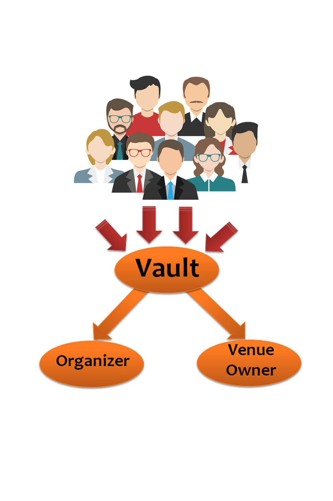

Split the Donations
====

I have noticed a common scheme for event organizers and venues.

> Split the donations (between the event organizer) and a venue (bar, coffee shop, coworking space...) (50 / 50)%

* [Front end](https://mohamedhayibor.github.io/splitDonations/) (wip)
* [contract code](https://github.com/mohamedhayibor/splitDonations/blob/master/contracts/splitDonations.sol) | deployed on [mainnet](https://etherscan.io/address/0xcea99a910ab4a50225e93b9b96f53ae8f4ceb92d)

Usage:
=========



Just tell the attendees the address of your contract, then they can donate whatever amount they wish using metamask.

* Assumption: The organizer will make sure of the conversion to fiat to be given to non-profits.
* The contract is the owner of the funds until split between event organizer and venue owner.


Dev setup:
========

For local development, you must run a [local server](https://github.com/MetaMask/faq/blob/master/DEVELOPERS.md#globe_with_meridians-https---web-server-required).

Easy/fast way: go to source path

```sh
$ python -m SimpleHTTPServer
```

Then go to [localhost:8000](http://localhost:8000/)
